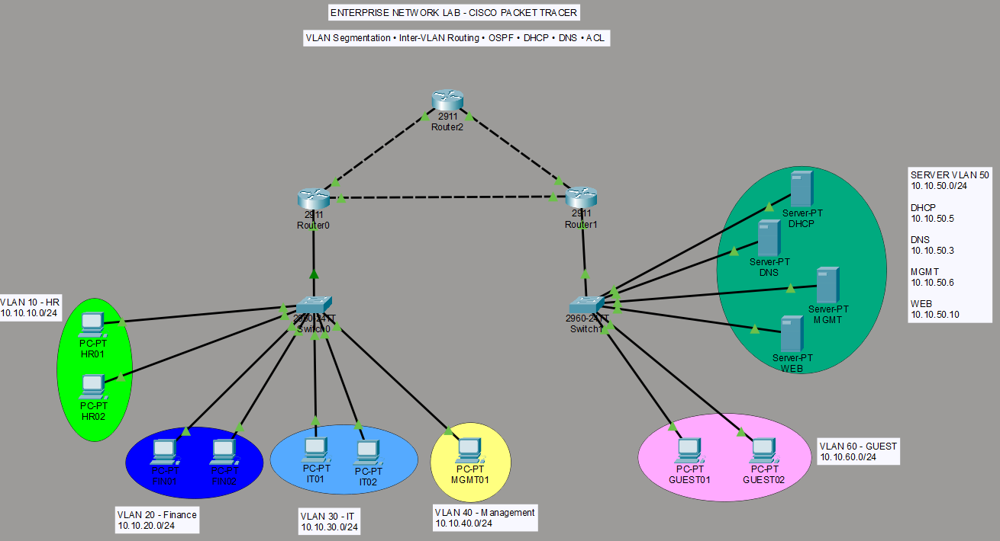

# Enterprise Network Lab

A mini enterprise network laboratory built with Cisco Packet Tracer.

This project simulates a small enterprise network with multiple departments,
centralized network services, dynamic routing, and ACL-based network segmentation.

## Network Topology

## Network Design

The network consists of three routers, two switches, multiple VLANs,
and a dedicated server network.

### VLAN & IP Addressing

| VLAN | Department | Network | Gateway |
|---|---|---|---|
| 10 | HR | 10.10.10.0/24 | 10.10.10.1 |
| 20 | Finance | 10.10.20.0/24 | 10.10.20.1 |
| 30 | IT | 10.10.30.0/24 | 10.10.30.1 |
| 40 | Management | 10.10.40.0/24 | 10.10.40.1 |
| 50 | Server | 10.10.50.0/24 | 10.10.50.1 |
| 60 | Guest | 10.10.60.0/24 | 10.10.60.1 |

## Server Services

| Service | IP Address |
|---|---|
| DNS | 10.10.50.3 |
| DHCP | 10.10.50.5 |
| Management Server | 10.10.50.6 |
| Web Server | 10.10.50.10 |

The web server is accessible using:

`http://company.local`

## Technologies

- Cisco Packet Tracer
- VLAN
- Inter-VLAN Routing
- Static Routing
- OSPF
- DHCP
- DHCP Relay
- DNS
- HTTP / HTTPS
- Extended ACL
- Network Segmentation

## Security Policy

Network access is controlled using extended ACLs.

Examples:

| Source | Destination | Result |
|---|---|---|
| HR | Finance | Denied |
| Finance | HR | Denied |
| IT | Finance | Allowed |
| IT | HR | Allowed |
| IT | Guest | Denied |
| Management | HR | Allowed |
| Management | Finance | Allowed |
| Management | IT | Allowed |
| Management | Guest | Denied |
| Guest | Internal Networks | Denied |
| Guest | Web Server | Allowed |
| Guest | DNS | Allowed |

## Validation

The network was tested using:

- `ping`
- `ipconfig`
- `nslookup`
- `show ip route`
- `show ip interface brief`
- `show access-lists`
- Web browser testing
- ACL hit counters

### Example Validation Results

- DHCP address assignment: **Successful**
- DNS resolution: **Successful**
- Web server access: **Successful**
- Inter-VLAN routing: **Successful**
- OSPF neighbor establishment: **Successful**
- Guest isolation from internal networks: **Successful**
- ACL-based access control: **Successful**

## Troubleshooting Experience

During testing, several ACL-related issues were identified and resolved.

One important finding was that standard IPv4 ACLs are stateless. For example,
traffic initiated from IT toward Finance could be permitted while the return
traffic was blocked by the Finance ACL.

ACL hit counters were used to identify and verify the affected traffic.

## Project File

The Cisco Packet Tracer project file is available here:

`enterprise-network-lab.pkt`

## Future Development

Planned improvements:

- Internet connectivity
- NAT / PAT
- Default route
- ISP simulation
- Stateful firewall concepts
- Network monitoring and logging
- Linux-based network services
