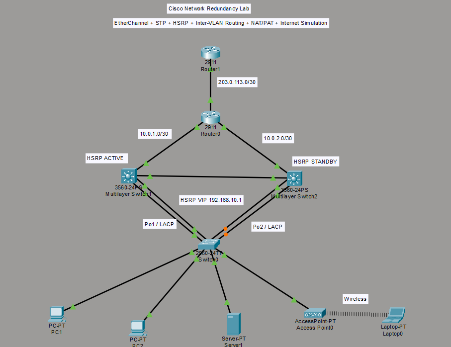

# Cisco Network Redundancy Lab

Cisco Packet Tracer lab focused on **network redundancy, high availability, inter-VLAN routing, and Internet connectivity simulation**.

## Topology



## Technologies

- **EtherChannel + LACP** — link aggregation and redundancy
- **STP** — prevents Layer 2 loops and provides alternate paths
- **HSRP** — default gateway redundancy
- **Inter-VLAN Routing** — communication between VLANs
- **NAT/PAT** — translates private IPs for external connectivity
- **DHCP & Wireless** — client addressing and Wi-Fi connectivity

## VLAN & HSRP

| VLAN | Network | HSRP VIP |
|---|---|---|
| 10 | 192.168.10.0/24 | 192.168.10.1 |
| 20 | 192.168.20.0/24 | 192.168.20.1 |
| 30 | 192.168.30.0/24 | 192.168.30.1 |
| 40 | 192.168.40.0/24 | 192.168.40.1 |

**HSRP:** L3-SW1 = Active (110), L3-SW2 = Standby (100)

## Key Configuration

```cisco
! EtherChannel / LACP
channel-group 1 mode active
channel-group 2 mode active

! STP
spanning-tree vlan 10 priority 4096

! HSRP
interface vlan 10
 ip address 192.168.10.2 255.255.255.0
 standby 10 ip 192.168.10.1
 standby 10 priority 110
 standby 10 preempt

! Inter-VLAN Routing
ip routing

! PAT
ip nat inside source list 1 interface gigabitEthernet 0/2 overload

! Internet Simulation
Client → HSRP → L3 Switch → Router0 → NAT/PAT → Router1/ISP → 8.8.8.8

! Verification
show etherchannel summary
show spanning-tree vlan 10
show standby brief
show ip route
show interfaces trunk
show ip nat translations

! Testing
PC → Gateway ✅
PC → Server (different VLAN) ✅
PC → 8.8.8.8 ✅
STP alternate-path failover ✅
