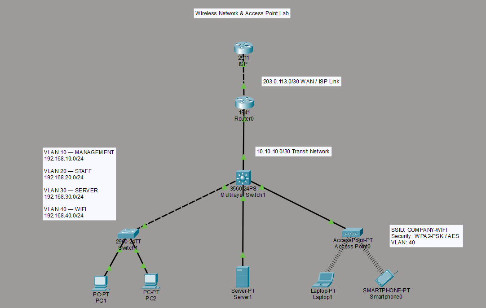

# 📡 Wireless Network & Access Point Lab

A Cisco Packet Tracer lab focused on wireless network connectivity,
VLAN segmentation, network security, NAT/PAT, and secure device management.

This lab simulates a small enterprise wireless environment where
wireless clients connect through an Access Point and access internal
and external network resources according to defined network policies.

---

## 📌 Project Overview

The network is designed with separate VLANs for management, staff,
servers, and wireless clients.

The wireless network is isolated into a dedicated VLAN and secured
using WPA2-PSK authentication. Network access is controlled using
ACLs, while NAT/PAT is implemented to provide internet connectivity
for internal clients.

The lab also demonstrates secure remote management of network
devices using SSH.

---

## 🗺️ Network Topology



---

## 🏗️ Network Architecture

The network consists of:

- **Layer 3 Switch** — Inter-VLAN routing, DHCP, and ACL
- **Access Switch** — Wired client connectivity and VLAN management
- **Router** — NAT/PAT and WAN connectivity
- **Access Point** — Wireless network access
- **Server** — Internal server network
- **ISP Router** — Internet connectivity simulation
- **Wireless Clients** — Laptop and smartphone

---

## 🌐 VLAN & IP Addressing

| VLAN | Name | Network | Purpose |
|------|------|---------|---------|
| 10 | MANAGEMENT | 192.168.10.0/24 | Network management |
| 20 | STAFF | 192.168.20.0/24 | Staff clients |
| 30 | SERVER | 192.168.30.0/24 | Internal servers |
| 40 | WIFI | 192.168.40.0/24 | Wireless clients |

### Default Gateways

| VLAN | Gateway |
|------|---------|
| VLAN 10 | 192.168.10.1 |
| VLAN 20 | 192.168.20.1 |
| VLAN 30 | 192.168.30.1 |
| VLAN 40 | 192.168.40.1 |

---

## 📡 Wireless Configuration

The Access Point provides wireless connectivity through a dedicated
Wi-Fi VLAN.

| Configuration | Value |
|---------------|-------|
| SSID | `COMPANY-WIFI` |
| Security | WPA2-PSK |
| Encryption | AES |
| Wi-Fi VLAN | VLAN 40 |
| Network | 192.168.40.0/24 |
| Address Assignment | DHCP |

Wireless clients obtain their IP configuration automatically from
the DHCP service provided by the Layer 3 switch.

---

## 🔐 Network Security

### Wireless Security

The wireless network uses:

- WPA2-PSK authentication
- AES encryption
- Dedicated Wi-Fi VLAN

This prevents wireless clients from being placed directly into
the internal staff or management network.

### ACL-Based Segmentation

An extended ACL is used to restrict wireless clients from accessing
the internal server VLAN.

```text
WIFI VLAN (192.168.40.0/24)
            │
            │
            ▼
       Layer 3 Switch
            │
            ├── ❌ Server VLAN (192.168.30.0/24)
            │
            └── ✅ Other permitted traffic
